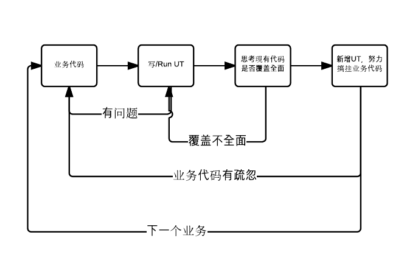

我和单元测试的故事
===

2013年3月，我加入了唯品会，结识了几位对我帮助很大的朋友，带我认识了单元测试。这作为故事的分水岭，我们先讲讲这之前的故事。

###Part Ⅰ

我第一次听说单元测试是在大二的时候，当时开始自学Java，听说了一本神书《Agile Java中文版:测试驱动开发的编程技术》，说不仅可以学会Java还可以学会如何编写出高质量的代码。后来才知道这本书就是在教Java的同时，一开始就融入了TDD的过程。这就是第一次与TDD相识。

当时还是学生的我，没有什么经历，没能理解这背后到底能带来多大好处。之后的实习工作也没有什么改变，总结一下还是环境问题：

* 项目小
* 团队小
* 身边的人都没有写UT的经历

这时，不是没有问题，只不过这些问题不尖锐。

我们也会遇到：

1. 各种bug
2. 组员之间代码互相影响
3. 老bug复现

但是：

1. 代码量少，bug很快可以被定位，发现之后也能很快修复。
2. 团队小沟通成本小，很多冲突也能很快被修复。
3. 老bug复现时，当时修复的人很快能想起来这是个老bug，知道怎么修。

如果那时身边有人能用UT的方法论影响团队，其实很多错是不会犯的，很多时间是不必浪费的。

###Part Ⅱ

来到唯品会之后，认识了[单经理](http://shanhh.com/)等小伙伴，发现：原来真的有人写UT！

抱着学习的心态我也开始了写UT的道路，刚开始没有那么多的感悟，就是感觉写写UT可以测测自己写的代码对不对。

刚开始是参加一个web项目，使用了单元测试之后的感触是：

1. 不需要启动tomcat就可以测自己写的对不对，你也知道用鼠标在浏览器界面上（或者别的图形界面）操作有多麻烦，特别是没有快捷键支持的时候
2. 各种情况都可以模拟出来，当你有类似的场景时，copy已写的UT改一改就好了，也很快
3. 一个功能写完之后，在页面上自测的时候比较轻松，因为很多东西你知道你用单元测试测过了，肯定没问题

说白了，我一开始体会到的是**UT可以提高自测效率**上。

###Part Ⅲ

有时候提交给测试的功能，会犯一些比较低端但是又往往会疏忽的问题，每次被测试姐姐发现，不管什么原因，犯低端错误总是很没有面子。

于是每次写完基本的UT之后总会将IDE分为两屏，一边业务，一边UT，根据IDE插件提供的代码覆盖情况，仔细想两个问题：

1. UT还没覆盖哪些已有的代码（工具往往可以直接指出来）
2. 我写什么样的UT才能把我的代码搞挂
3. 别的类里面的业务会不会从共用类、数据库、缓存之类的层面上影响我的代码，从而搞挂我的业务

带着这三个问题，我往往可以发现很多漏写的代码判断、漏写的逻辑、系统各部分间有哪些牵扯、哪些可能有隐患、哪些是不合理的设计（这是一个有益的副产品）。

发现的有些是比较隐秘的问题，更多的是常见的却疏忽的问题。这是我才发现：

**单元测试并不是为了发现那些隐秘的问题，他发现的是那些低级或者是常见的问题。**我们以为我们可以靠小心杜绝这类问题，但是仔细回想一下线上出现的问题，大部分都是我们以为可以靠小心就可以避免的问题。

单元测试逼迫我自己仔细思考，然后再仔细思考，尽量在最早的时候发现问题。要不然就会发生很没面子的事。

###Part Ⅳ

当时，我们的团队是一个想干就干的年轻团队，很多新框架新技术感觉不错，duang！就加进去了！感觉有个思想可以大大优化我们的系统，duang!一个短会过后就开干了！

当时大家都沉浸在团队战斗力太强的喜悦中，也没做太多思考。直到有一次我重构到一部分没有UT的代码。

我感觉到了恐惧！我读完了同事的代码，我感觉我看懂了，我感觉我也有思路，改完之后就是提心吊胆的，那一天的效率很低。回家的路上我就在思考这个问题，只有一个感叹，**单元测试岂止给了我们质量，更重要的是信心。**

对自己写完的代码增加UT，在你蹂躏完自己的代码后，你对自己的代码正确性是有信心的。

对一段有UT保障的代码做重构，结束之后跑一遍UT，当所有UT都通过的时候，你对这次重构的效果是有信心的。你没有改变它本有的逻辑，你是无罪的。

所以之后每次我在用UT给别人洗脑的时候，我总会说：UT可以让你过上幸福愉快的幸福，因为你再也不用提心吊胆。

###Part Ⅴ

随着自己写UT的时间增长，自己越来越喜欢UT，越来越认识到UT的价值。夸张的说，我感觉UT是无价的，写的越多越全面越好，因为我就会越有信心。

同事之间也会交流UT的经验，我甚至还帮团队做过UT的分享。经常被人问到的问题是：

1. UT真的有这么厉害吗
2. 怎样写好UT
3. TDD那一套东西太难实践了，怎么办
4. 我们也想写UT，但是业务开发那么紧张，哪有时间写UT，你们那个部门肯定很闲

第一个问题，我一直感觉没必要回答。我遇到的每一个质疑UT的人，都没有长时间写过UT的人，我只是建议他们**坚持写UT一段时间，至少是1年，写过上百个UT之后再说。**如果这时候还感觉没用，也罢，本来世界上就没有100%对每个人都有效果的东西。

第二个问题，我将在这个repository中用实例讲解。也欢迎大家fork项目之后提交你们的经验。

第三个问题我想了好久好久。回想自己的开发的过程，实际上也没遵从TDD的步骤，但是我依然让UT发挥了很大的作用。所以还是要抓住一个理论的核心，至于步骤，没那么多对和错，更没有一个不变的标准。

我的步骤是这样的：

1. 分逻辑写业务代码，每个逻辑感觉写完的时候
2. 开始给这个逻辑写UT，每增加一个或者两个UT运行一次，看看有没有问题
3. 有问题就立刻改正，没有问题就继续进行步骤2，直到代码在行数上覆盖到所有的重要逻辑
4. 思考怎样可以直接搞挂所写的逻辑，增加UT，完善业务
5. 思考别的类里面的业务会不会从共用类、数据库、缓存之类的层面上影响我的代码，从而搞挂所写的业务
6. 继续下一个逻辑回到步骤1

你可以按照这个步骤尝试写UT，**你可以，我也推荐你放弃TDD(或者FDD、BDD)的标准框架，但是不要放弃写UT。**

第四个问题涉及到国情，国内公司业务驱动，业务代码都没时间写，哪有时间写UT。于是就不写了。这个前提没错，但是结论是错的。

写UT不是“是非问题”。

每个人的时间都是有限的，在UT价值和开发时间上应该学会找平衡点。单纯的追求100%甚至1%以上的UT覆盖率是没有意义的。例如我后来就减少了参数格式的UT，因为有些格式的参数确实在现实中不可能发生，这样的UT就是在浪费时间。

慢慢我也才感悟到**写UT不是为了编写无比健壮的系统，而是尽量趋近正确的系统。**多写一个“有价值”的UT就可以保证离正确更近一步。同时，写一个毫无意义却无比健壮的程序也是没有意义的。

###Part Ⅵ

说到底，开发程序就像生产汽车，UT就是汽车上的安全设备。

* 很多安全设备都不会派上用场
* 但是驾驶员因为有这些设备会更安心
* 我们可以肆无忌惮的为了增加安全而增加各种安全设备，但是很多设备并不会带来实际效果
* 但是也不能因为有成本就一个安全设备也不要了

少废话，UT写起来！